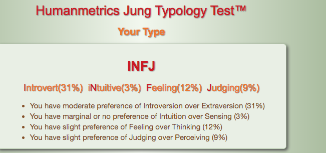
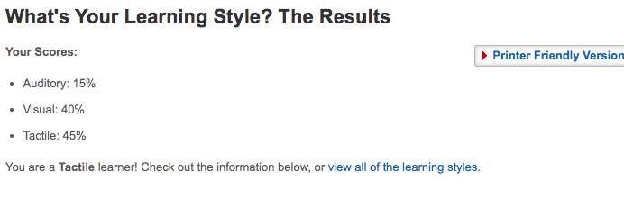
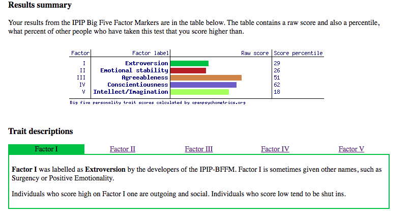

# Assessment1 

<body style="background-color:powderblue;">
  

<html>

<body>

<h1 style="border: 2px solid Tomato;">PERSONAL BACKROUND</h1>

My name is Brayden and I was born and raised in Queensland, Australia. My education to date is the completion of high school. Introduction to IT and introduction to programming are my first studies upon leaving highschool. I have just recently returned from a two year working holiday in Canada in the rocky mountains. In the winter I worked as a lift operator and in the summer I worked as a server. An interesting fact about me is that i'm obsessed with all board sports; snowboarding, skateboarding and surfboarding. 

<h1 style="border:2px solid Violet;">INTEREST IN IT</h1>

Being born into the 21st century I have grown up with evolving technology all around me. So given that it would be hard not to be interested in it. Some of my many interests in IT include; gaming, video editing and social media such as Instagram to post my travels and adventures.

From a very young age I was interested in IT. My earliest memories were playing on my grandparents Nintendo 64 occasionally when visiting them. Then as I got a little older playing on the Playstation 1 with my Dad. This is where the sparks really started, playing Crash Bandicoot and Tony Hawk's Pro skater. My interest continued to grow with the always evolving technology in my life. I remember the Christmas when the first Nintendo Wii came out begging my parents for one. This was my first time interacting and using a wireless controller that has a pointer and detects motion. This interest in gaming has stayed with me to date, currently I game on my Xbox 1, playing games like Call of duty.

My official IT experience is little to none. In grades 11 and 12 I studied an IT course for one of my subjects. In this course we learnt very basic website design, basic code language and basic games design using Scratch. Other than that my IT experience only includes self teaching, for example teaching myself how to edit videos. 

I chose to study intro to programming and intro to IT at RMIT because I thoroughly enjoyed studying IT at school and wanted to further develop this interest as a possible career path. I believe that IT will be an always changing and ever growing aspect in human life, therefore as a career it would be interesting and as an individual you would always be learning. I chose RMIT through open universities Australia upon my return from Canada because I thought it was time to expand on my interests in IT.

I expect to learn a very broad idea of what IT is and grasp a basic concept of some code language. I expect to be prepared and setup for my bachelor of IT which I will study at RMIT after my courses. I also expect to learn about potential jobs in the world of IT and even possibly discover what career path would interest me. 

<h1 style="border:2px solid Pink;">IDEAL JOB</h1>

The job I found is an IT security specialist based where I live, which I found on Indeed.

An IT security specialist’s main job is to defend an organization's information systems. This can include tasks like preventing cyber attacks by installing security software, monitoring and protecting against security breaches and countering cyber attacks. One of the reasons this type of position seems appealing to me is because during this pandemic and currently being not employed, it has really made me question what work is essential. I believe that cyber security will always be something that is essential and will always have a demand from organizations. Another key reason is that cyber security is in high demand across all organizations from; corporations, government agencies, schools, universities and  medical practices. In today's society with IT growing everyday and storage of data in the cloud becoming more popular I feel that cyber security is more important than ever.

  

To become an IT security specialist it is required that a student has studied cyber security and IT skills that include; IT fundamentals, cloud security, cryptography, network security, database security, ethics for IT professionals, and project management. It is also important that they understand programming languages such as C, C++, Java, and PHP. The qualifications include at least Bachelor's level or higher qualification in Information Technology and Formal IT Security qualifications recognised by the Australia Computer Society. As well as all this, most employers require that you have problem solving skills, critical thinking skills and communication skills. This is because security specialist’s must explain complex IT issues in basic terms to help managers make decisions.

Currently in relation to IT I have very basic skills and experience and no qualifications. My experience in IT comes from many years of using the devices I own such as; laptops, Iphones and gaming devices. This experience is mostly only handy for my everyday leisure. Some basic IT skills that I have self taught are in video editing. I have learnt skills such as; cutting, cropping, speed editing, sound editing, transitional editing, importing and exporting.

I plan to obtain the skills needed by passing my current two courses Introduction to Programming and Introduction to IT. Then I plan to continue on my path towards obtaining my bachelor of IT. I also plan on doing a more indepth course focused on cyber security.

<h1 style="border:2px solid Green;">PERSONAL PROFILE</h1>

Myers Briggs test:

Online learning style test:

Online Big 5 personality test: 

These online tests help to give a further and more in depth look at some of my personality traits. For example both my tests were leaning more to the introverted side of the spectrum. I found it interesting to know what type of learner I am and what kind of learning I work well with. These tests mean a good deal to me, helping to learn a bit more about myself and what kind of person I am. Some people may take this test very literally and some people may take them with a grain of salt. I believe that my results were for the most part pretty correct to what I or others may perceive my personality traits to be like. Therefore meaning to me a somewhat literal perception of my personal traits which help me understand what type of person I am.

When looking at these results and reflecting on how they compare with working in a team I believe there could be some room for improvement. This is because on the personality tests I resulted in a more withdrawn introverted personality. Meaning I don’t enjoy being the center of attention. This may affect how I work in a group, for example I may voice my opinions over others in a large group scenario and therefore not get my ideas out. Although my results were introverted it also showed that I was genuinely interested in other people and engaging with them. This means I will have strong engagement when working with others in my team. 

  

I should take this into account when forming a team by better preparing myself for social group situations. I could make my work in a team better by opening up a little bit more and making sure to engage socially with all my team members, building relationships with them. Possibly finding other members that are more on the extroverted side to help synergise and bring out some more social engagement and interaction.

  

<h1 style="border:2px solid White;">PROJECT IDEA</h1>
<h2 style=" 2px solid white; color:white;">Overview:</h2>

My project idea is a smartphone app designed for skateboarders called “skaterMate”. SkaterMate is a platform for skateboarders to enjoy skateboard content, share their own skateboard content, view skateboard tutorials and find help on a trick they have been trying to get. SkaterMate will also be a platform for helpful information on skate spots and skate parks. A section of the app will allow skateboarders to share their street spots they have found that are able to skate. Not only that, it will offer reviews, descriptions and when is the best time to be at designated skate parks. SkaterMate will also be a platform that skate companies can use to get local skateshops on the map or sell hardware dedicated to skateboarding.

<h2 style=" 2px solid white; color:white;">Motivation:</h2>

My motivation behind this project is to offer a platform for like minded people, passionate about skateboarding. I wish to create a platform dedicated to skateboarders that want to progress in their craft. Skateboarding can be very intimidating when beginning but SkaterMate aims to help beginners and make learning easier. This could be useful to the skateboard community in many ways; helping the community grow, helping skateboarders progress and learn, getting our local skate shops advertised and helping talented skateboarders get recognized.

  
  
<h2 style=" 2px solid white; color:white;">Description</h2>

Content feature:

Content feature: Skateboarders will be able to upload content directly from their camera roll. Before posting there will be options available for editing the clips with the built in editing software. This software will be mostly basic including; a speed editor, cut and trimmer and an importer for music. Then before upload there will be an option for a description about the post. After posting other users will be able to view and leave feedback on the video. Another option before posting videos is stamping, this will allow users to select what skateboard tricks are performed in the video. This feature will be great for other skateboarders that want to improve their skills. They can search for a specific trick and all videos stamped with the named trick will be displayed. There will also be a subsection of the content part of the app dedicated to tutorials, this is where the most experienced skateboarders can upload specific tutorials for each trick they wish to upload.

 

Information feature: Another subsection of the app will allow users to click on a pop up section that displays useful information for skateboarders. Users can upload secret street spots they have skateboarded or they have found and pin it onto a map. Other users can open the map built into the app and click on these pins to reveal where these spots are, how to get there and a helpful description on the location. Another part of the information feature will allow users to review information on designated skateboard parks in their area. This information will include; reviews from other users, the best time to skate these parks (in relation to crowds) and photos/clips of the skatepark. This map will also have local skateboard shops pinned in a users local area.

  

Shop feature: Within the third section of the app users can open will take them to a section that sells hardware for skateboarders. This will include links to popular brands that sell things such as; wheels, trucks, bearings, bushings, nuts and bolts.

  

Layout: Each of these three features will be broken up into sections of the app that users can navigate through. When a user opens SkaterMate the content page will be displayed and will act as a homepage. This section will be split into two parts; the regular skateboard content feed and skateboard tutorial feed. There will be two tappable options at the top of the content feed called ‘skateboard tutorials’ and ‘skateboard clips’. Users will be able to scroll through a feed of videos and open the videos they want to watch. The other two features will sit in each of the bottom corners of the content screen. Users will have the option to tap on a map icon in the bottom left or a shop icon in the bottom right.

  
 
The map icon will open up a map of the area nearby and will use location services. The map will reveal skate spots, skateparks and skate shops that are pinned onto the map. These pins will have a tappable feature that will open up useful information related to what they click on. Blue pins will be local skate shops, green pins will be skate spots and pink pins will be skateparks.

The shop icon will open up to a different scrollable feed that will display links to different online stores. It will also show products available at their local skate shops. 

  

  

